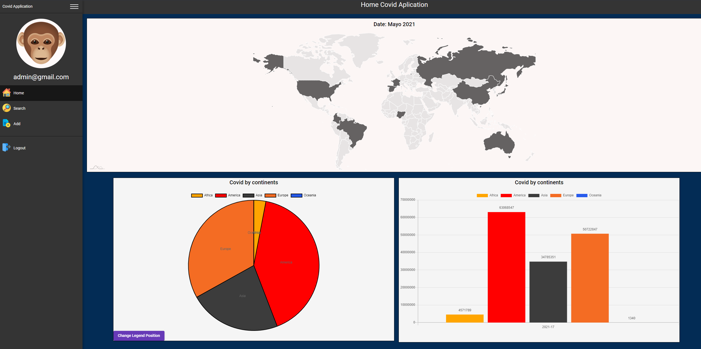

# Covid Application (Front Angular)

This project show the data of death an cases of covid around world until 2021 May 26th.

## Installation

Use the package manager [npm](https://www.npmjs.com/) to install the dependencies.

```bash
npm install
```

## Visuals





## Development server

Run `ng serve` for a dev server. Navigate to `http://localhost:4200/`. The app will automatically reload if you change any of the source files.

## Build

Run `ng build` to build the project. The build artifacts will be stored in the `dist/` directory. Use the `--prod` flag for a production build.

## Running unit tests

Run `ng test` to execute the unit tests via [Karma](https://karma-runner.github.io).

## Running end-to-end tests

Run `ng e2e` to execute the end-to-end tests via [Protractor](http://www.protractortest.org/).

## Backend

You can find the backend in this link https://github.com/VManuelPM/CovidBack
